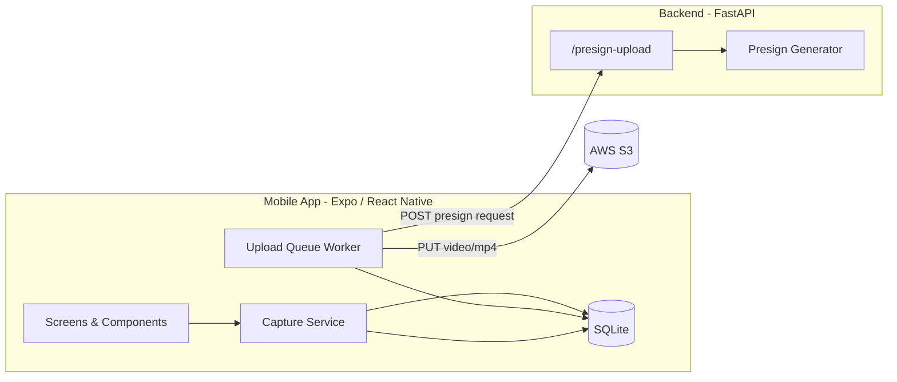

# EgoCapture — Egocentric Video Capture System

EgoCapture is a phone app that lets field workers record first-person videos from their Android device. When someone finishes a recording, the video is saved safely on the phone first — even without internet. When a connection is available, the app uploads it to the cloud automatically in the background. If an upload fails, the app keeps trying and the worker can retry later from a simple library screen.

Behind the scenes, a small server helps the phone send each video to cloud storage (AWS S3) without storing passwords or secret keys on the device. The phone asks the server for a temporary, one-time upload link, sends the file directly to the cloud, and marks it as uploaded once confirmed. This project was built for the [Locara Labs technical assignment](Locara_Labs_Assignment-1.pdf) — covering video capture, reliable local storage, automatic cloud sync, and the infrastructure design that supports it at scale.

---

## Getting started

### Backend

```bash
cd backend
python3 -m venv .venv
source .venv/bin/activate
pip install -r requirements.txt
cp .env.example .env
# Edit .env with AWS region, bucket, and credentials
uvicorn app.main:app --host 0.0.0.0 --port 8000 --reload
```

Verify: `curl http://localhost:8000/health` → `{"status":"ok"}`

### Mobile app

```bash
cd mobile
npm install
npm run android
```

The Android script starts the emulator if needed, installs Expo Go, and opens the app. The emulator expects the backend at `http://10.0.2.2:8000` (set in `app.json`).

**Demo login:** `worker@locara.com` or `+919876543210`

**Environment files:** copy `backend/.env.example` → `backend/.env`. Mobile config is optional via `mobile/.env.example` or `app.json` `expo.extra`. AWS credentials stay in the backend only.

---

## Architecture



Record video → save to SQLite (`pending`) → background worker requests a presigned URL → PUT to S3 → confirm via ETag → mark `uploaded`.

Further design detail: [TECHNICAL.md](./TECHNICAL.md) · AWS infrastructure: [INFRA.md](./INFRA.md)
