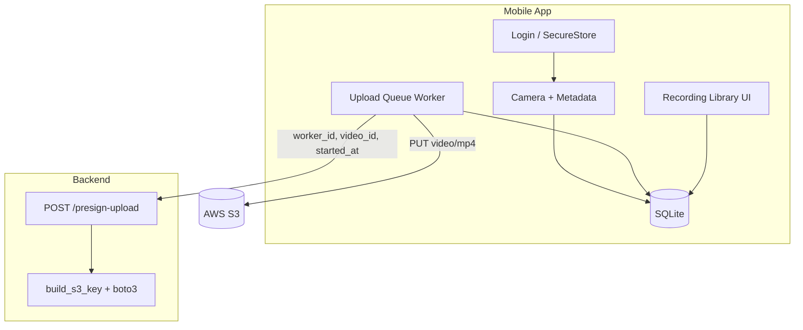

# Technical Design Document

This document describes how EgoCapture works under the hood — architecture, data flow, database design, upload reliability, and what to expect at scale. For AWS bucket layout, IAM, and cost planning, see [INFRA.md](./INFRA.md).

---

## 1. System overview

EgoCapture has two main parts:

| Component | Role |
|-----------|------|
| **Mobile app** (Expo / React Native, TypeScript) | Record video, store locally, queue uploads, show library |
| **Backend API** (FastAPI, Python) | Issue short-lived S3 upload links — no video bytes pass through the server |

The phone never holds AWS credentials. It saves every recording on disk and in SQLite first, then syncs to the cloud when possible.

### Architecture diagram



### Mobile code layout

```
mobile/src/
  screens/       Login, Home, Capture, Recording Library
  services/      auth, capture, upload, video delete
  db/            schema, migrations, repositories
  components/    video cards, KPI tiles, player
  hooks/         upload queue stats for UI
  utils/         backoff, user messages, formatting
```

---

## 2. Data flow: capture → database → queue → S3

### Step 1 — Record

1. Worker taps **Record** → app generates a `video_id` (UUID v4).
2. Camera records until stop or 60s limit.
3. App collects metadata: timestamps, device info, optional GPS and battery.

### Step 2 — Save locally

1. Video file copied to `documents/videos/{video_id}.mp4`.
2. Row inserted in SQLite with `upload_state = pending`.
3. Upload worker is woken to process the queue.

### Step 3 — Upload (background)

1. Worker checks network — skips if offline, retries later.
2. Picks oldest eligible `pending` or `failed` video for this worker.
3. Shows **Preparing** (500ms) then **Uploading** in the UI.
4. Calls backend `POST /presign-upload` with `worker_id`, `video_id`, `started_at`.
5. Backend returns a presigned PUT URL scoped to one S3 key.
6. App uploads the file directly to S3.
7. S3 returns an **ETag** → app marks row `uploaded` and stores key + ETag in `metadata_json`.

### Upload state machine

```
pending ──► uploading ──► uploaded   (terminal)
                │
                └──► failed ──► (backoff / manual retry) ──► pending
```

**Safety rules:**

- If the app dies mid-upload, next launch runs `recoverInterruptedUploads()` → `uploading` becomes `pending`.
- `markUploaded()` only runs when current state is `uploading` — a confirmed upload never goes back to `pending`.
- `markUploading()` uses a conditional update so two processes cannot claim the same row.

Every transition is logged in `upload_events` for debugging.

---

## 3. Database design

SQLite database: `egocentric_capture.db` (WAL mode, foreign keys on).

### Table: `videos`

One row per recording. Core columns:

| Column | Purpose |
|--------|---------|
| `video_id` | UUID, unique, S3 idempotency key |
| `worker_id` | Tied to logged-in worker |
| `started_at`, `ended_at`, `duration_ms` | Recording window |
| `file_size_bytes`, `fps`, `fps_tier`, `resolution` | Media info |
| `local_path` | File on device |
| `upload_state` | `pending` · `uploading` · `uploaded` · `failed` |
| `attempt_count`, `last_error`, `last_attempted_at` | Retry tracking |
| `metadata_json` | GPS, battery, S3 key, ETag, network type at upload |

### Table: `upload_events`

Append-only audit log: `video_id`, `from_state`, `to_state`, `error_message`, `created_at`.  
Foreign key to `videos(video_id)` with `ON DELETE CASCADE`.


---

## Retry, backoff, and idempotency

### Exponential backoff

| Setting | Value |
|---------|-------|
| Delays | 2s → 4s → 8s → 16s → 32s → 64s (capped) |
| Max automatic attempts | 6 |
| After max failures | Stays `failed` until worker taps **Retry** in library |

Failed uploads respect `last_attempted_at` + backoff before the queue picks them again.

### Idempotency (no duplicate objects in S3)

1. **`video_id` is stable** — created at record start, never changes.
2. **S3 key is deterministic** — `worker_id={id}/date={YYYY-MM-DD}/video_id={uuid}.mp4` (see [INFRA.md](./INFRA.md)).
3. **Retry uploads to the same key** — a failed attempt does not create a second object; it overwrites or completes the same path.
4. **State claims are atomic** — `UPDATE ... WHERE upload_state IN ('pending','failed')` prevents double-processing.

### Upload confirmation

The app trusts the upload only after S3 returns an **ETag**. In a full production pipeline, add S3 `ObjectCreated` → Lambda for server-side ingestion records (detailed in INFRA.md Q4).

---

## 5. AWS design (summary)

Full answers: **[INFRA.md](./INFRA.md)**

| Topic | Decision |
|-------|----------|
| Storage | Single S3 bucket per environment |
| Key layout | `worker_id` → `date` → `video_id.mp4` |
| Security | Presigned PUT URLs; 15 min TTL; IAM `s3:PutObject` only |
| Backend | `backend/app/presign.py`, CLI: `presigned_url_generator.py` |

---

## 6. Scalability — what breaks first at 10,000 workers?

Assume **10K workers × 20 videos/day × ~50 MB** ≈ **200K uploads/day** and **~10 TB new data/day**.

### Likely bottlenecks (in order)

| Layer | What happens | Mitigation |
|-------|--------------|------------|
| **1. S3 storage cost** | ~900 TB after 90 days if nothing is archived | Lifecycle rules → Glacier (see INFRA.md Q3) |
| **2. Presign API** | 200K POSTs/day is modest for FastAPI on a small fleet | Horizontal scale behind ALB; stateless API |
| **3. Per-device SQLite** | One phone holds one worker’s rows — fine at tens of thousands of local videos | Pagination already in library; optional archive-old-rows job |
| **4. Upload queue on device** | One-at-a-time upload per worker — correct for mobile bandwidth | Already serial; no change needed |
| **5. S3 request rate** | 200K PUTs/day per prefix spread across workers — well within S3 limits | Prefix sharding by `worker_id` + `date` |
| **6. Central ingestion DB** | Assignment uses on-device state only | Production needs Lambda + RDS/Dynamo from S3 events |

### What does **not** break easily

- **S3 write throughput** — keys spread across workers and dates.
- **Idempotency** — `video_id` prevents duplicate objects.
- **Offline-first** — workers keep recording; queue drains when online.

---

## Related documents

- [README.md](./README.md) — overview and quick start  
- [INFRA.md](./INFRA.md) — AWS Q1–Q5 (bucket, IAM, cost, confirmation)
